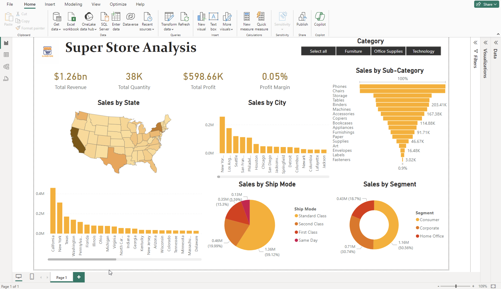

# SuperStore-Dashboard
Supper stores (in USA) data analysis and dashboard with PowerBI

This repository contains a PowerBI project and the corresponding data file for visualizing super stores data in USA.

## Screenshot 📷

## Files
- Supersotore_Project1.pbix: The PowerBI project file.
- SampleSuperstore.csv: The data file used in the PoweBI project.

## How to Use
1. Open Supersotore_Project1.pbix in PowerBI.
2. Ensure the data source is connected to SampleSuperstore.csv.
3. Explore the dashboards and visualizations.
